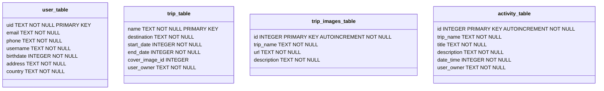

## Data Model

### MVVM Architecture

The MVVM (Model-View-ViewModel) architecture is used to separate the development of the graphical user interface from the business logic (The domain layer). 
This helps in organizing the code and making it more maintainable and reusable.

### Components

#### Model
The Model represents the data and business logic of the application. It is responsible for managing the data, whether it is from a local database or a remote server.

**Entities:**
- **User**
  - `uid`: `String` - Unique identifier for the user.
  - `email`: `String` - Email of the user.
  - `phone`: `String` - Phone number of the user.
  - `username`: `String` - Username of the user.
  - `birthdate`: `ZonedDateTime` - Birthdate of the user.
  - `address`: `String` - Address of the user.
  - `country`: `String` - Country of the user.

- **Trip**
  - `name`: `String` - Unique identifier for the trip.
  - `destination`: `String` - Destination of the trip.
  - `startDate`: `ZonedDateTime` - Start date of the trip.
  - `endDate`: `ZonedDateTime` - End date of the trip.
  - `itinerary`: `List<Activity>` - List of activities that form an Itinerary for the trip.
  - `images`: `List<Image>` - List of images for the trip.

- **Activity**
  - `id`: `Int` - Unique identifier for the activity.
  - `tripId`: `Int` - Identifier of the trip to which the item belongs.
  - `title`: `String` - Title of the activity.
  - `description`: `String` - Description of the activity.
  - `dateTime`: `ZonedDateTime` - Date and time when the activity starts.

- **Image**
  - `tripId`: `Int` - Identifier of the trip to which the image belongs.
  - `url`: `String` - URL of the image.
  - `description`: `String` - Description of the image.


#### View
The View is responsible for displaying the data to the user and handling user interactions.
It is the UI of the application (all the composable functions).


#### ViewModel
The ViewModel acts as a bridge between the Model and the View. It holds the data required by the View and handles the logic to update the Model based on user interactions.

**Responsibilities:**
- Fetching data from the Model and exposing it to the View.
- Handling user actions and updating the Model accordingly.
- Managing the state of the UI components.

### Relationships
- A `User` can have multiple `Trip`s with their respective `Activity`s.
- A `Trip` can have multiple `Activity`s.
- A `Trip` can have multiple `Image`s.

### Visualization of the Model


  
## Database schema
### Mermaid diagram



### SQL table creation

 - user_table
```
  CREATE TABLE IF NOT EXISTS `trip_table`(
      `name` TEXT NOT NULL,
      `destination` TEXT NOT NULL,
      `start_date` INTEGER NOT NULL,
      `end_date` INTEGER NOT NULL,
      `cover_image_id` INTEGER,
      `user_owner` TEXT NOT NULL,
      PRIMARY KEY(`name`),
      FOREIGN KEY(`cover_image_id`) REFERENCES `trip_images_table`(`id`) ON DELETE SET NULL,
      FOREIGN KEY(`user_owner`) REFERENCES `user_table`(`uid`) ON DELETE CASCADE
  )
```

 - trip_table
```
CREATE TABLE IF NOT EXISTS trip_table (
    name TEXT NOT NULL PRIMARY KEY,
    destination TEXT NOT NULL,
    start_date INTEGER NOT NULL,
    end_date INTEGER NOT NULL,
    cover_image_id INTEGER,
    user_owner TEXT NOT NULL,
    FOREIGN KEY(cover_image_id) REFERENCES trip_images_table(id) ON UPDATE NO ACTION ON DELETE SET NULL,
    FOREIGN KEY(user_owner) REFERENCES user_table(uid) ON UPDATE NO ACTION ON DELETE CASCADE
);
```
 - trip_images_table
```
CREATE TABLE IF NOT EXISTS trip_images_table (
    id INTEGER PRIMARY KEY AUTOINCREMENT NOT NULL,
    trip_name TEXT NOT NULL,
    url TEXT NOT NULL,
    description TEXT NOT NULL,
    FOREIGN KEY(trip_name) REFERENCES trip_table(name) ON UPDATE NO ACTION ON DELETE CASCADE
);
CREATE INDEX IF NOT EXISTS index_trip_images_table_trip_name ON trip_images_table (trip_name);
```
- activity_table
```
CREATE TABLE IF NOT EXISTS activity_table (
    id INTEGER PRIMARY KEY AUTOINCREMENT NOT NULL,
    trip_name TEXT NOT NULL,
    title TEXT NOT NULL,
    description TEXT NOT NULL,
    date_time INTEGER NOT NULL,
    user_owner TEXT NOT NULL,
    FOREIGN KEY(trip_name) REFERENCES trip_table(name) ON UPDATE NO ACTION ON DELETE CASCADE,
    FOREIGN KEY(user_owner) REFERENCES user_table(uid) ON UPDATE NO ACTION ON DELETE CASCADE
);
CREATE INDEX IF NOT EXISTS index_activity_table_trip_name ON activity_table (trip_name);
```


### Database usage

  - Create a Trip
```
INSERT INTO trip_table (name, destination, start_date, end_date, cover_image_id)
VALUES ('Summer Vacation', 'Hawaii', 1672531200, 1672617600, NULL);
```

  - Adding an Image to a Trip
```
INSERT INTO trip_images_table (trip_name, url, description)
VALUES ('Summer Vacation', 'https://example.com/image.jpg', 'Beach view');
```

  - Adding an Activity
```
INSERT INTO activity_table (trip_name, title, description, date_time)
VALUES ('Summer Vacation', 'Snorkeling', 'Snorkeling at the coral reef', 1672552800);
```

  - Retrieving Trips with Images and Activities
```
SELECT trip_table.*, trip_images_table.url AS cover_image, activity_table.title AS activity_title
FROM trip_table
LEFT JOIN trip_images_table ON trip_table.name = trip_images_table.trip_name
LEFT JOIN activity_table ON trip_table.name = activity_table.trip_name;
```

  - Deleting a Trip 
```
DELETE FROM trip_table WHERE name = 'Summer Vacation';
```
(This will also remove associated images and activities due to ON DELETE CASCADE)
